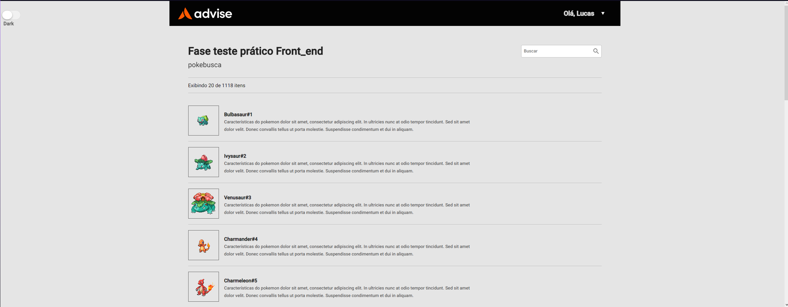

<h1 align="center">PokeBusca</h1>

Um projeto onde trás todos os pokemons registrados na [PokeAPI](https://pokeapi.co), com sistema de busca por nome e ID.

<br />

## Vamos começar 🚀

Aqui você terá instruções do que precisa e como iniciar o projeto

<br />

### Pré-Requisitos 📋
 - [NodeJS](https://nodejs.org/pt-br/)
 - [Angular CLI](https://angular.io/cli)
 - [Angular Material](https://material.angular.io)

<br />

### Instalação 🔧

- Caso esteja no github vá em uma pasta e digite ```git clone https://github.com/hash-luk/pokesearch.git```
- Entre na pasta do projeto e abra no seu editor de texto preferido. Recomendo [Visual Studio Code](https://code.visualstudio.com)
- Dentro da pasta do projeto, vá até o terminal e digite ```npm install``` para baixar as dependências do projeto
- Para abrir a aplicação no navegador digite ```ng serve --open``` // *É preciso ter a CLI do Angular*


## Ferramentas Utilizadas 🛠️

- [PokeApi](https://pokeapi.co)
- [Angular](https://angular.io)
- [Node](https://nodejs.org/pt-br/)
- [SCSS](https://sass-lang.com)
- [NGX Pagination](https://www.npmjs.com/package/ngx-pagination)
- [Angular Material](https://material.angular.io)

<br />


## Milha Extra 📏

- Desenvolvido sistema de dark mode, com um botão na lateral da páginapara não alterar o layout
- Adicionado animações e efeitos de hover

<br />


## Deploy 💻

Aplicação teve seu deploy realizado na [Vercel](https://pokesearch-five.vercel.app).

<br />


## Licença 📄

Verifique o arquivo de [Licença]() para mais informações.


<br />

## Autores ✒️
- Layout by: **Advise**
- Developed by: [**Lucas P**](https://github.com/hash-luk)


<br />

## Print 📷




<br />

<center>Desenvolvido com ❤️ por <a href="https://github.com/hash-luk">**Lucas P**</a></center>
